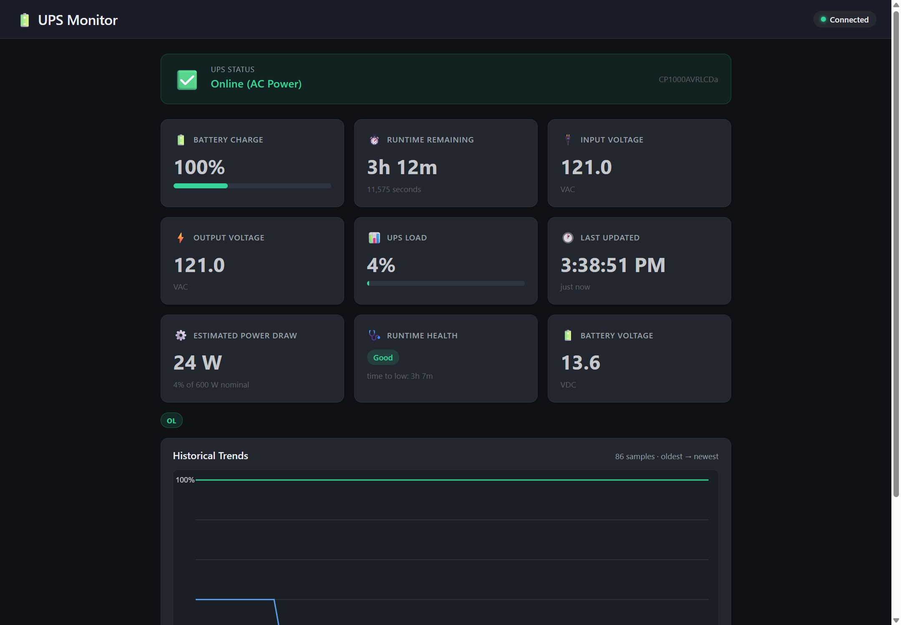
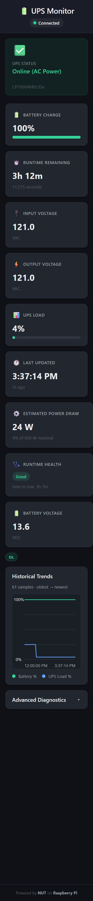
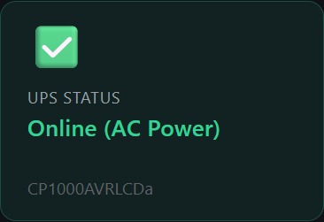

# 🔋 UPS Monitor Dashboard — Raspberry Pi + CyberPower

Real-time web dashboard to monitor a CyberPower UPS connected to a Raspberry Pi using [NUT (Network UPS Tools)](https://networkupstools.org/).


## 🖼️ Dashboard Screenshots

### Desktop View



### Mobile View



### Status Banner Detail



## 📊 Features

- **Real-time monitoring** — Battery %, voltage, load, runtime, UPS status
- **Auto-refresh** — Dashboard updates every 5 seconds
- **Status indicators** — Color-coded status (🟢 Online, 🟡 On Battery, 🔴 Low Battery)
- **Historical trends (Phase 2)** — Battery % and UPS load charts over time
- **Persistent telemetry logging (Phase 2)** — Lightweight JSONL history storage
- **Lightweight** — Vanilla HTML/CSS/JS frontend, Flask backend
- **Raspberry Pi optimized** — Minimal resource footprint
- **Easy deployment** — One-script install with systemd auto-start

## 🏗️ Architecture

```
CyberPower UPS → USB → Raspberry Pi → NUT (upsc) → Flask API → Web Dashboard
```

| Component | Technology |
|-----------|-----------|
| UPS Communication | NUT (`upsc ups@localhost`) |
| Backend API | Python + Flask |
| Frontend | HTML + CSS + JavaScript |
| Deployment | systemd service |
| Target | Raspberry Pi (any model with USB) |

## ⚡ Quick Start

### Prerequisites

- Raspberry Pi (any model) with Raspberry Pi OS
- CyberPower UPS connected via USB
- Python 3.9+
- NUT (Network UPS Tools)

### One-Line Install

```bash
git clone https://github.com/elbruno/rpi-ups-dashboard.git
cd rpi-ups-dashboard
chmod +x deploy/install.sh
sudo ./deploy/install.sh
```

This installs NUT, configures it for your CyberPower UPS, installs the Python app, and sets up a systemd service. The dashboard will be available at `http://<your-pi-ip>:5000`.

### Manual Quick Start (Development)

```bash
# Clone and install dependencies
git clone https://github.com/elbruno/rpi-ups-dashboard.git
cd rpi-ups-dashboard
pip install -r requirements.txt

# Run the app
python -m app.main
```

Open `http://localhost:5000` in your browser.

> **Note:** Without NUT running, the API will return mock/error data. See the detailed setup below for full NUT configuration.

## 📖 Detailed Setup Instructions

### Step 1: Install NUT on Raspberry Pi

```bash
sudo apt update
sudo apt install -y nut nut-client nut-server
```

### Step 2: Connect and Identify Your UPS

Plug the CyberPower UPS into the Pi via USB, then identify it:

```bash
sudo nut-scanner -U
```

This will show the detected UPS with its driver (usually `usbhid-ups` for CyberPower models).

### Step 3: Configure NUT

Edit the NUT configuration files. The `deploy/` folder includes pre-configured templates:

**`/etc/nut/ups.conf`** — UPS device configuration:
```ini
[ups]
    driver = usbhid-ups
    port = auto
    desc = "CyberPower UPS"
    vendorid = 0764
```

**`/etc/nut/upsd.conf`** — NUT daemon configuration:
```ini
LISTEN 127.0.0.1 3493
```

**`/etc/nut/upsd.users`** — Authentication:
```ini
[admin]
    password = your_password_here
    upsmon master
```

**`/etc/nut/nut.conf`** — NUT mode:
```ini
MODE=standalone
```

### Step 4: Start NUT Services

```bash
sudo systemctl enable nut-server nut-client
sudo systemctl start nut-server nut-client

# Verify UPS is communicating
upsc ups@localhost
```

You should see output like:
```
battery.charge: 100
battery.runtime: 3600
input.voltage: 120.0
output.voltage: 120.0
ups.load: 25
ups.status: OL
```

### Step 5: Install the Dashboard

```bash
cd /opt
sudo git clone https://github.com/elbruno/rpi-ups-dashboard.git
cd rpi-ups-dashboard
sudo pip install -r requirements.txt
```

### Step 6: Set Up as a System Service

```bash
sudo cp deploy/ups-dashboard.service /etc/systemd/system/
sudo systemctl daemon-reload
sudo systemctl enable ups-dashboard
sudo systemctl start ups-dashboard
```

The dashboard is now running at `http://<your-pi-ip>:5000` and will auto-start on boot.

### Step 7: Verify

```bash
# Check service status
sudo systemctl status ups-dashboard

# Check API
curl http://localhost:5000/api/ups

# Open dashboard in browser
# http://<your-pi-ip>:5000
```

## 🔌 API Reference

### `GET /api/ups`

Returns current UPS status as JSON.

**Response:**
```json
{
    "battery.charge": "100",
    "battery.runtime": "3600",
    "input.voltage": "120.0",
    "output.voltage": "120.0",
    "ups.load": "25",
    "ups.status": "OL",
    "ups.model": "CyberPower CP1500AVRLCD",
    "timestamp": "2026-04-19T15:30:00Z"
}
```

**UPS Status Codes:**
| Code | Meaning | Dashboard Color |
|------|---------|----------------|
| `OL` | Online (on AC power) | 🟢 Green |
| `OB` | On Battery | 🟡 Yellow |
| `LB` | Low Battery | 🔴 Red |
| `OL CHRG` | Online, Charging | 🟢 Green |
| `OB DISCHRG` | On Battery, Discharging | 🟡 Yellow |

### `GET /api/ups/history?limit=120`

Returns recent UPS history samples (oldest → newest) for charting.

**Response:**
```json
{
    "samples": [
        {
            "timestamp": "2026-04-19T15:30:00Z",
            "battery.charge": "100",
            "ups.load": "25",
            "ups.status": "OL"
        }
    ],
    "count": 1,
    "limit": 120
}
```

## ⚙️ History Storage Configuration

- `UPS_HISTORY_FILE` — optional path to history JSONL file (default: `data/ups_history.jsonl`)
- `UPS_HISTORY_MAX_ENTRIES` — max retained samples (default: `5000`)

See detailed plan: [`docs/phase-2-plan.md`](docs/phase-2-plan.md)

## 🧪 Running Tests

```bash
pip install -r requirements.txt
pytest tests/ -v
```

Tests use mock NUT data and don't require a physical UPS.

## 🛠️ Troubleshooting

### Installer fails during `apt update` (third-party repo signature error)

If installation fails with a message similar to:

`The repository 'https://downloads.plex.tv/repo/deb ... InRelease' is not signed`

that usually means an unrelated third-party APT repo on your Pi is broken.

The installer now retries automatically by temporarily disabling failing third-party repo entries, completes package installation, and restores those entries at the end.

### Dashboard loads but shows no UPS data

If the dashboard appears but metrics are empty and `/api/ups` returns `503`, NUT likely cannot talk to the UPS yet (for example: `Driver not connected`).

Check the basics:

- UPS is connected via USB and powered on
- NUT services are running:
    - `sudo systemctl status nut-server`
    - `sudo systemctl status nut-driver-enumerator` (or `nut-driver` on some distros)
- Direct NUT query works:
    - `upsc ups@localhost`

If logs mention `insufficient permissions on everything`, the USB device node permissions are too strict for the `nut` user. The installer now deploys a local udev rule (`/etc/udev/rules.d/99-ups-dashboard-nut-usb.rules`) for CyberPower devices and reloads udev rules automatically.

The UI now surfaces this backend error directly in the status banner so you can diagnose faster.

## 📁 Project Structure

```
rpi-ups-dashboard/
├── app/
│   ├── __init__.py          # Package init
│   ├── main.py              # Flask app + routes
│   ├── ups_reader.py        # NUT data parsing
│   └── static/
│       ├── index.html        # Dashboard UI
│       ├── style.css         # Styling
│       └── script.js         # Auto-refresh logic
├── tests/
│   ├── __init__.py
│   ├── test_ups_reader.py   # Parser unit tests
│   └── test_api.py          # API endpoint tests
├── deploy/
│   ├── install.sh           # One-script Pi setup
│   ├── ups.conf             # NUT UPS config template
│   ├── upsd.conf            # NUT daemon config
│   ├── upsd.users           # NUT auth template
│   └── ups-dashboard.service # systemd unit file
├── requirements.txt
├── README.md
└── docs/
    └── ups-monitor-prd.md   # Product Requirements
```

## 🗺️ Roadmap

- [x] **Phase 1 — MVP:** Real-time status display, single API endpoint, auto-refresh
- [x] **Phase 2 — Enhancements:** Historical charts (battery over time), data logging
- [ ] **Phase 3 — Automation:** Alerts (email/webhook on battery), auto-shutdown scripts

## 🤝 Contributing

Contributions welcome! Please open an issue or submit a PR.

## 📄 License

MIT License — see [LICENSE](LICENSE) for details.
